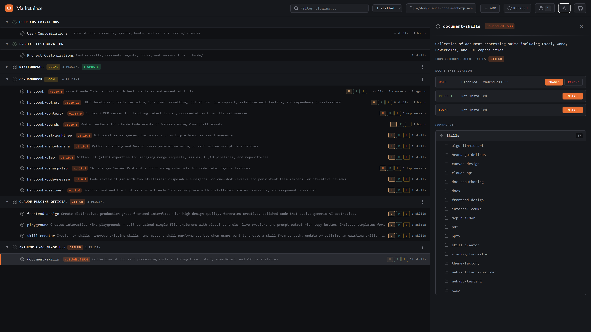
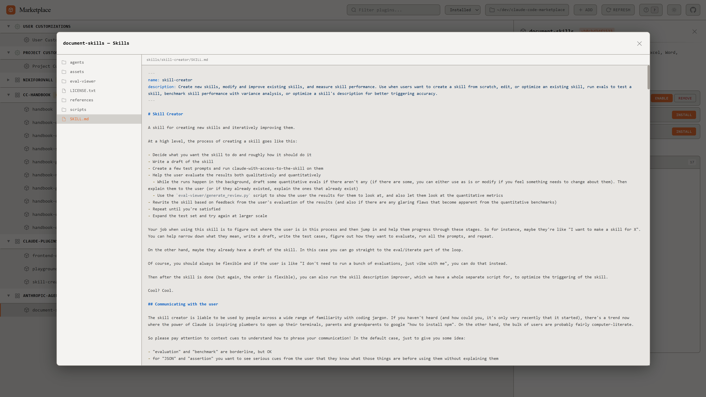

# Claude Code Marketplace

A web-based dashboard for browsing, installing, and managing [Claude Code](https://docs.anthropic.com/en/docs/claude-code) plugins across multiple marketplaces.

[](https://www.npmjs.com/package/claude-code-marketplace)

<p align="center">
  
</p>

<details>
<summary>Light theme & file preview</summary>

<p align="center">
  
</p>

<p align="center">
  
</p>

</details>

## Quick Start

```bash
npx claude-code-marketplace --open
```

Or with a custom port:

```bash
npx claude-code-marketplace --port 8080
```

### Options

```
--port <number>   Custom port (default: 3457)
--project <path>  Project directory for project-scoped plugins
--open            Open browser on start
```

## Features

- **Multi-marketplace browser** — aggregate plugins from GitHub repos, git URLs, and local directories
- **Scope management** — install, enable, and disable plugins per scope (user / project / local)
- **Component inspection** — browse skills, commands, agents, MCP servers, hooks, and LSP servers inside each plugin
- **File preview** — read plugin source files directly in the browser with syntax highlighting
- **Marketplace actions** — add, update, and remove marketplace sources
- **PWA support** — installable as a standalone desktop app with offline caching
- **Dark / light theme** — styled with IBM Plex Mono, orange accent palette
- **Keyboard-first** — vim-style navigation, press `?` for shortcuts

## How It Works

The server reads `~/.claude/plugins/` to discover installed marketplaces and plugin registries. Each marketplace points to a directory containing a `.claude-plugin/marketplace.json` manifest listing available plugins.

The UI renders a tree of marketplaces with their plugins. Clicking a plugin opens its detail panel showing description, version, scope installation matrix, and filesystem-based component breakdown.

All plugin management operations (install, uninstall, enable, disable) delegate to `claude plugin` CLI commands.

## Tech Stack

- **Frontend** — vanilla JS single-page app, no framework dependencies
- **Backend** — Express.js serving static files + REST API
- **Styling** — CSS custom properties with dark/light theme support
- **Icons** — inline SVG (Feather-style, 24x24 viewBox)
- **Linter** — Biome with husky pre-commit hook

## Development

```bash
git clone https://github.com/NikiforovAll/claude-code-marketplace.git
cd claude-code-marketplace
npm install
npm run dev
```

```bash
npm run lint        # check with biome
npm run lint:fix    # auto-fix
```

## License

MIT
