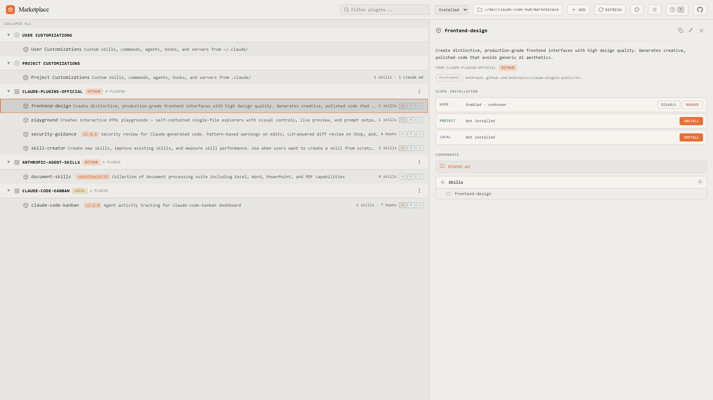
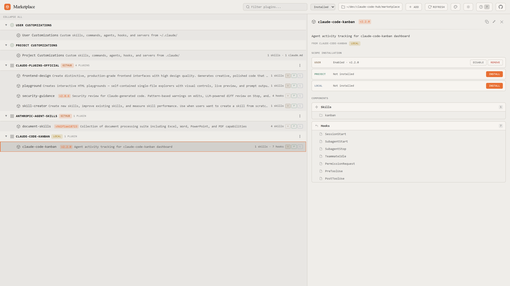
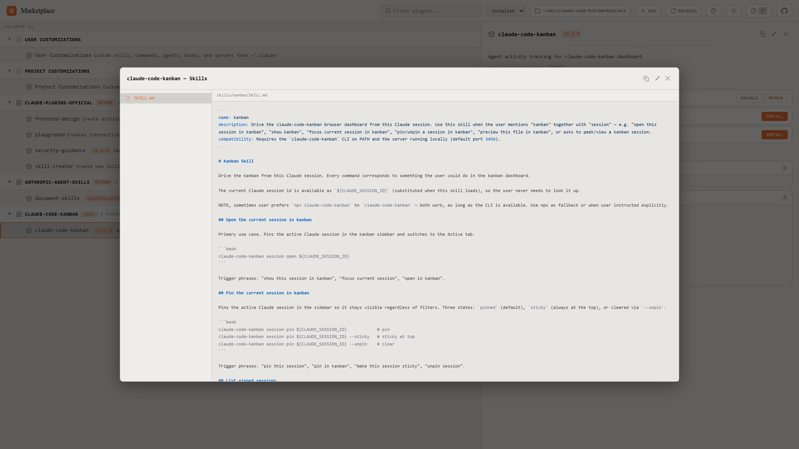
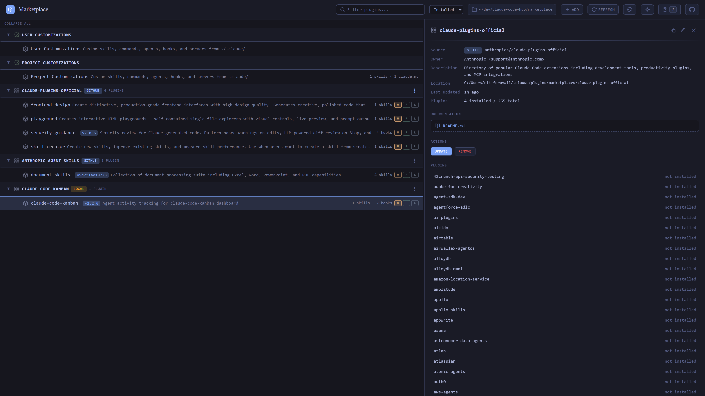

# Claude Code Marketplace

[](https://www.npmjs.com/package/claude-code-marketplace)
[](LICENSE)
[](https://www.npmjs.com/package/claude-code-marketplace)

**[Live Demo & Docs](https://nikiforovall.blog/claude-code-marketplace/)**

> Browse, install, and manage [Claude Code](https://docs.anthropic.com/en/docs/claude-code) plugins across multiple marketplaces.



## Getting Started

```bash
npx claude-code-marketplace --open
```

That's it — the dashboard reads your `~/.claude/plugins/` registry and opens in the browser. All install/uninstall/enable/disable operations delegate to the official `claude plugin` CLI, so Claude Code must be installed and on your PATH.

## Features

- **Multi-marketplace browser** — aggregate plugins from GitHub repos, git URLs, and local directories
- **Scope management** — install, enable, and disable plugins per scope, with `U`/`P`/`L` state badges (user / project / local)
- **Component inspection** — browse skills, commands, agents, MCP servers, hooks, and LSP servers inside each plugin
- **File preview** — read plugin source files directly in the browser with syntax highlighting
- **Full catalog view** — marketplace info panel shows every plugin a source offers, installed or not
- **User & project customizations** — your local `~/.claude/` and `./.claude/` skills, commands, agents, and hooks appear as browsable virtual marketplaces
- **Marketplace actions** — add, update, and remove marketplace sources
- **17 color themes** — Ember, Gruvbox, Catppuccin, Tokyo Night, Dracula, Nord, and more — each in light and dark
- **Keyboard-first** — vim-style navigation, press `?` for shortcuts
- **PWA support** — installable as a standalone desktop app







## Configuration

```
--port <number>   Custom port (default: 3542, falls back if busy)
--project <path>  Project directory for project-scoped plugins
--dir <path>      Custom Claude config dir (default: ~/.claude)
--open            Open browser on start
```

The config dir can also be set via the `CLAUDE_CONFIG_DIR` environment variable.

## License

MIT
